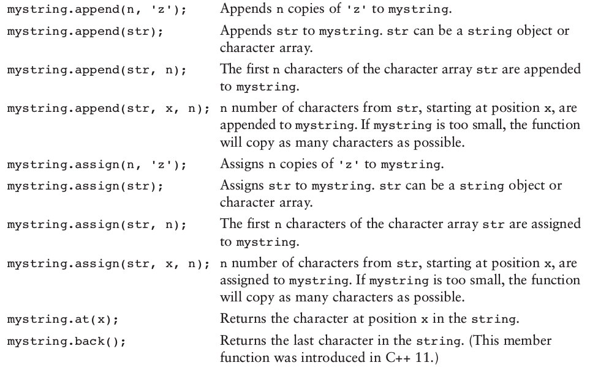
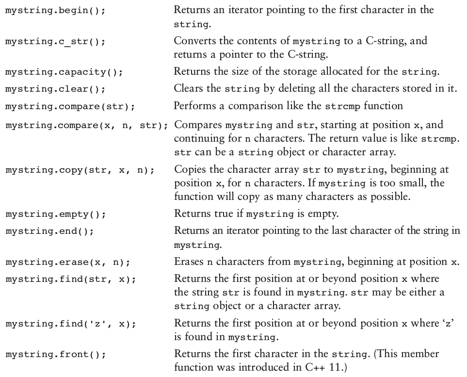
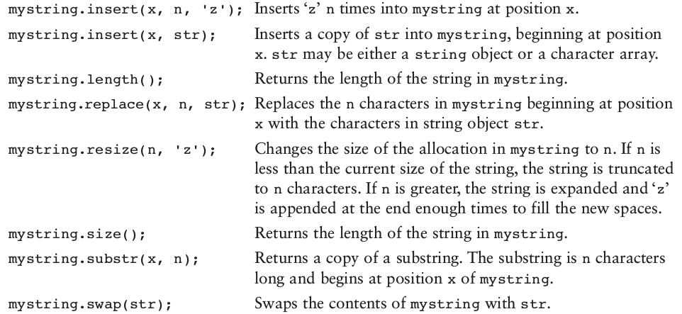

# C++ for C Programmers

## Compiling
#### Compile and run a C program using terminal
```
gcc hello.c -o hello
./hello
``` 

#### Compile and run a C++ program using terminal
```
g++ hello.cpp -o hello
./hello
```

## Memory Management
#### The keyword `new` replaces `malloc` and `delete` replaces `free`
``` cpp
char* s = new char[size];   // dynamically allocate memory for an array
delete [] s;                // free the allocated memory
s = nullptr;                // good practice for preventing errors
```

## Pointers
#### Constant Values/Pointers
``` cpp 
// this function accepts a pointer to an array of constants
void displayPayRates(const double *rates, int size)
{
    for (int count = 0; count < size; count++)
    {
        cout << *(rates + count) << endl;
    }
}

// constant pointers can not point to something else
int value = 22;
int * const ptr = &value; 

// this is a constant pointer to a constant
int number = 15;
const int * const ptr = &number 
```

## Pass By Reference
#### Swap in C
``` c
// i and j are pointers to ints
void swap(int* i, int *j)
{
    int temp = *i; // dereference i
    *i = *j;
    *j = temp;
}

// call C function
// pass addresses of a and b
swap(&a, &b);    
```

#### Swap in C++
``` cpp
// i and j are references to ints
inline void swap(int &i, int &j)
{
    int temp i; // no need to dereference
    i = j;
    j = temp;
}

// C++ supports function overloading unlike C
inline void swap(double &i, double &j)
{
    double temp i;
    i = j;
    j = temp;
}

// call C++ function
// no need to pass addresses
swap(a, b);    
```

## Vectors in C++
```cpp
#include <vector>
using namespace std;

vector<int> numbers1;                   // an empty vector of ints
vector<int> numbers2(10);               // a vector of 10 ints
vector<int> numbers3(10, 2);            // a vector of 10 ints, each initialized to 2
vector<int> numbers4 {10, 20, 30, 40};  // a vector initialized with an initialization list
vector<int> myVec(numbers4);            // a vector initialized with the elements of numbers4 

int val = myVec.at(index);  // return the value of the element located at index of myVec
int* arr = myVec.data();    // return the underlying int array of myVec
myVec.push_back(50);        // create a last element (if myVec is full) and stores 50 in it
myVec.pop_back();           // remove the last element from myVec
myVec.size();               // get the number of elements in myVec
myvec.capacity();           // get the capacity of myVec
myVec.clear();              // completely clear the contents of myVec
myVec.empty();              // return true if myVec is empty
myVec.reverse();            // reverse the order of elements in myVec
myVec.resize(size, val);    // resize myVec. the new elements are initialized with val
myVec.swap(someVec);        // swap the contents of myVec with the contents of anotherVec
```

## Character Functions
```cpp 
#include <cctype>   // required for using the following functions
```  
#### Character Testing
| Function  | Returns true if the argument is a ...; returns 0 otherwise |
| :-------: | :--------------------------------------------------------- |
| `isalpha` | letter of the alphabet.                                    |
| `isalnum` | letter of the alphabet or a digit.                         |
| `isdigit` | digit from 0 through 9.                                    |
| `islower` | lowercase letter.                                          |
| `isprint` | printable character (including a space).                   |
| `ispunct` | printable character other than a digit, letter, or space.  |
| `isupper` | uppercase letter. Otherwise, it returns 0.                 |
| `isspace` | whitespace character. (`''`, `' \n '`, `' \v '`, `' \t '`) |

#### Character Case Conversion
| Function  | Description                                       |
| :-------: | :------------------------------------------------ |
| `toupper` | Returns the uppercase equivalent of its argument. |
| `tolower` | Returns the lowercase equivalent of its argument. |

## C-Strings
### Working With C-Strings
``` cpp 
#include <cstring>   // required for using the following functions
```  

#### The `strlen` function
``` cpp 
// don't confuse the length of a string with the size of the array holding it
char name[] = "Thomas Edison";
int length = strlen(name); // length is 13
```

#### The `strcat` function (see also: `strncat`)
*If the array holding the first string isn't large enough to hold both strings,
`strcat` will overflow the boundaries of the array.*
``` cpp 
char string1[100] = "Hello ";   // string1 has enough capacity for strcat 
char string2[] = "World!";
strcat(string1, string2);
cout << string1 << endl;        // outputs "Hello World!"
```

#### The `strcpy` function (see also: `strncpy`)
*`strcpy` performs no bounds checking. The array specified by the first 
argument will be overflowed if it isn’t large enough to hold the string
specified by the second argument.*
``` cpp
char name[] = "Some other string";  // size of the holding array is sufficient
strcpy(name, "Albert Einstein");
```

#### The `strstr` function
``` cpp
char arr[] = "Four score and seven years ago";
char *ptr = strstr(arr, "seven");   // search for "seven" and return address
cout << ptr << endl;                // outputs "seven years ago"
```

#### The `strcmp` function
``` cpp
int strcmp(char *string1, char *string2); // function prototype
```
The result is
 - **zero** if the two strings are **equal**.
 - **negagive** if string1 comes **before** string2 in alphabetical order.
 - **positive** if string1 comes **after** string2 in alphabetical order.

### C-String/Numeric Conversion Functions
``` cpp 
#include <cstdlib>   // required for using the following functions

//Converts a c-string to an integer.
int intVal = atoi("1000");

//Converts a c-string to a long value.
long longVal = atoi("1000000");

//Converts a c-string to a double/float value.
float floatVal = atoi("12.67");
double doubleVal = atoi("12.67");

// returns a numeric argument converted to a c-string object
to_string(int value);
to_string(long value);
to_string(long long value);
to_string(unsigned value);
to_string(unsigned long value);
to_string(unsigned long long value);
to_string(float value);
to_string(double value);
to_string(long double value);
```

## Strings
#### Defining `string` objects
``` cpp 
#include <string>           // required for using the string data type

string str0;                // defines an empty string

string str1 = "Hello";      // defines a string initialized with "Hello"

string str2("Greetings!");  // defines a string initialized with "Greetings!"

string str3(str2);          // defines a string which is a copy of str2.
                            // (str2 may be either a string or a c-string)

char cStr[] = "abcdefgh";   // this has to be a c-string, not a string
string str4(cStr, 5);       // defines a string which is initialized 
                            // to the first 5 characters in the c-string cStr

string str5('x', 10);       // defines a string initialized with 10 'x' chars

string str6(str5, 2, 8);    // defines a string which is initialized
                            // with a substring of str5. 
```
#### `string` operators
There is no need to use a function such as `strcmp` to compare string objects. 
You may use the `<` , `>` , `<=` , `>=` , `==` , and `!=` relational operators.

``` cpp
string s1 = "Hello ";
string s2 = "World!";
string mystring = s1 + s2;  // concatenates s1 and s2
char c = mystring[0];       // returns the char at position 0 in mystring
```
#### `string` member functions




## Generics in C++
#### Generic Swap in C++
``` cpp
template <class T>
inline void swap(T &i, T &j)
{
    T temp i;
    i = j;
    j = temp;
}
    
// call C++ function
// no need to pass addresses
swap(a, b);   
```

#### Generic Summation of an Array in C++
``` cpp
template<class T>
T sum(const T data[], int size, T s = 0)    // elements of const array can not be modified
{
    for (int i = 0; i < size; ++i)
    {
        s += data[i];
    }
}

// call the function
sum(scores, 92);        // sum = 0 by default
sum(scores, 92, 58);    // sum = 58 to begin with
```

## Operator Overloading in C++
``` cpp
// define a new enum type
typedef enum days {SUN, MON, TUE, WED, THU, FRI, SAT} days;

// overload the increment operator
inline days operator++ (days d)
{
    return static_cast<days>((static_cast<int>(d) + 1) % 7);    
}

// overload the bit shift operator
ostream& operator<< (ostream &out, const days &d)
{
    switch (d)
    {
        case SUN: out << "SUN"; break;
        case MON: out << "MON"; break;
        case TUE: out << "TUE"; break;
        case WED: out << "WED"; break;
        case THU: out << "THU"; break;
        case FRI: out << "FRI"; break;
        case SAT: out << "SAT"; break; 
    } 
}

// use the overloaded operators
int main()
{
    days d = MON, e;
    e = ++d;
    cout << d << '\t' << e << endl;
}
```

## Structs
``` cpp
// declare a struct
struct CityInfo
{
    string cityName;
    string state;
    long population;
    int distance;
};

// define a struct
CityInfo location;
CityInfo cities[20];

// initialize a struct
CityInfo location = {"Asheville", "NC", 50000, 28};
CityInfo location = {"Atlanta"};  // only cityName is initialized 
CityInfo cities[2] = {{"Asheville", "NC", 50000, 28}, 
                      {"Atlanta", "GA", 45000, 90}};

// access struct members
location.population = 4750;
cout << location.population << endl;

// declare a nested struct
struct EmployeeInfo
{
    string name;
    int employeeNumber;
    CityInfo birthPlace;
};

// access nested struct members
EmployeeInfo manager;
manager.birthPlace.population = 4750;
cout << manager.birthPlace.population << endl;
```
**Note:** *By default, structures are passed to functions by value.*<br>
**Note:** *You can return local structs defined in functions unlike arrays.*

#### Dynamically Allocating Structs
``` cpp
struct Circle
{
    double radius;
    double diameter;
    double area;
};

Circle* cirPtr = new Circle;
Circle* circles = new Circle[5];

// access members after dereferencing the struct pointer
cirPtr->radius = 1.1;
cirPtr->area = 2.2;

// array elements are structs, not pointers
for (int i = 0; i < 5; i++)
{
    circles[i].radius = 1.1 * i;
    circles[i].area = 2.2 * i;
}
```

## Classes
``` cpp
class Point
{
    public:

        // this is the preferred constructor usage
        Point(double x = 0.0, double y = 0.0) : x(x), y(y) {}

        /**
         * This is also a valid constructor:
         * Point()
         * {
         *     this->x = 0.0;  // or x = 0.0;
         *     this->y = 0.0;  // or y = 0.0;
         * }
         */

        double getX()
        {
            return x;    
        }
        
        void setX(double v)
        {
            x = v;    
        }

        // pass the point objects by reference for efficiency
        point operator+ (point &p1, point &p2)
        {
            point sum = {p1.x + p2.x, p1.y + p2.y}
            return sum;
        }

        // pass the point object by reference for efficiency
        ostream& operator<< (ostream &out, const point &p) 
        {
            out << "( " << p.x << ", " << p.y << " )";
            return out;
        }

    private:

        double x;
        double y;
}
```

#### Destructors
``` cpp
class Node
{
    public:

        Node(int d = 0, Node* ptr = nullptr) : data(d), next(ptr) {}
 
    private:

        int data;
        Node* next;
}

class List
{
    public:

        List() : head(nullptr), cursor(nullptr) {}
        ~List();
        void prepend(int value);
        int getElement();
        void advance();
        void print();

    private:

        Node* head;
        Node* cursor;
}

List::~List()
{
    for (cursor = head; cursor != nullptr; )
    {
        cursor = head->next;
        delete head;
        head = cursor;
    }
}
```
